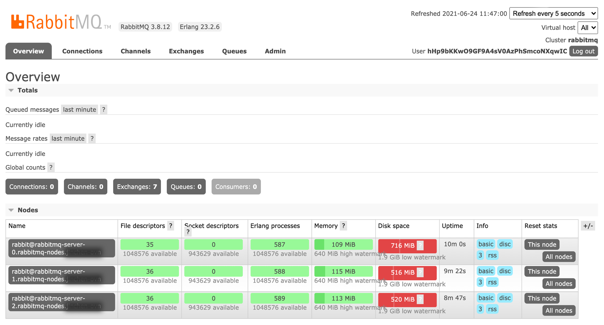

# Использование пользовательского интерфейса управления RabbitMQ

В этой статье рассматриваются основные операции в пользовательском интерфейсе управления RabbitMQ (интерфейс управления). Для получения дополнительной информации, пожалуйста, обратитесь к [Официальной документации RabbitMQ](https://www.rabbitmq.com/docs/management).

## Получение адреса доступа к пользовательскому интерфейсу управления RabbitMQ

### Экземпляр без доступа к кластеру извне

Если у экземпляра не включена функция доступа к кластеру извне, необходимо настроить балансировщик нагрузки для установки обратного прокси.

<Tabs>
  <Tab label="Веб-консоль">
    1. В области **Клиент** нажмите **Добавить порт управления**.

    2. Настройте связанные параметры в соответствии с инструкциями ниже.

       | Параметр                  | Описание                                                                                                                                                                                   |
       | ------------------------- | ------------------------------------------------------------------------------------------------------------------------------------------------------------------------------------------- |
       | **Балансировщик нагрузки** | Производители и потребители за пределами кластера будут получать доступ к экземпляру через адрес этого балансировщика нагрузки.                                                              |
       | **Порт**                  | Балансировщик нагрузки слушает входящий трафик на этом порту и получает запросы доступа по TCP от производителей и потребителей.                                                          |
       | **Группа внутренней маршрутизации** | Трафик доступа по умолчанию будет перенаправляться на экземпляр через этот внутренний маршрутизатор.                                                                                     |
       | **Сохранение сессии**     | Если сохранение сессии основывается на **хешировании исходного адреса**, запросы доступа с одного и того же IP-адреса всегда будут перенаправляться на соответствующую подсистему внутреннего маршрутизатора. |

    3. Нажмите **Добавить**.

    4. Нажмите на ссылку в столбце **Порт**, чтобы войти в пользовательский интерфейс управления RabbitMQ в новой вкладке браузера.
  </Tab>
</Tabs>

### Экземпляр с включенным доступом к кластеру извне

<Tabs>
  <Tab label="Веб-консоль">
    1. В левом навигационном меню нажмите **RabbitMQ**.

    2. Нажмите на ***Название экземпляра***.

    3. На вкладке **Метод доступа** нажмите на ***Адрес портала управления***.
  </Tab>
</Tabs>

После входа в пользовательский интерфейс управления RabbitMQ страница будет выглядеть так, как показано на рисунке ниже:

## Использование пользовательского интерфейса управления RabbitMQ

1. Обратитесь к [Управлению пользователями](../../functions/20-user), чтобы получить информацию для входа.

2. Создайте обмен.

   1. На вкладке **Обмены** разверните **Добавить новый обмен**.

   2. Заполните необходимую информацию и нажмите **Добавить обмен**.

3. Создайте очередь.

   1. На вкладке **Очереди** разверните **Добавить новую очередь**.

   2. Заполните необходимую информацию и нажмите **Добавить очередь**.

      > **Совет**: Настройка разумных параметров времени ожидания сообщений (например, `x-message-ttl=3600000`) может предотвратить накопление сообщений. Избыточное накопление сообщений может повлиять на требования к постоянным объемам из-за оставшихся неиспользованных старых сообщений, что приведет к недостатку места для размещения новых сообщений.

4. Привяжите очередь к обмену.

   1. На вкладке **Обмены** щелкните по имени обмена.

   2. Разверните **Связи**, введите название целевой очереди и установите **Ключ маршрутизации**.

   3. Нажмите **Привязать**.

5. Отправьте сообщения.

   1. На вкладке **Обмены** щелкните по имени обмена.

   2. Разверните **Опубликовать сообщение**, введите **Ключ маршрутизации**, установленный в обмене, и заполните содержимое сообщения в **Полезной нагрузке**.

   3. Нажмите **Опубликовать сообщение**.

6. Получите сообщения.

   1. На вкладке **Очереди** щелкните по имени очереди.

   2. Разверните **Получить сообщения** и нажмите **Получить сообщение(я)**.

   3. Просмотрите содержимое сообщения.
