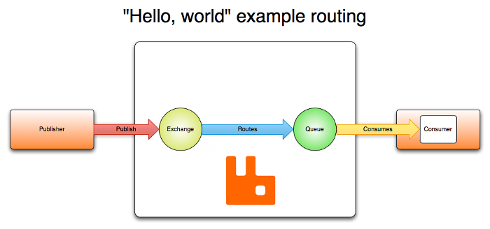

# 架构

RabbitMQ 的架构基于消息队列模式，包括多个组件，如生产者、消息队列、消费者和代理。

在 RabbitMQ 中有几个角色：

- **生产者**：生产者负责创建和发送消息到 RabbitMQ 的消息队列。它们将消息发布到交换器，并指定消息的路由键。
- **交换器**：交换器接收来自生产者的消息，并根据消息的路由键将其路由到一个或多个消息队列。交换器有多种类型，如直接交换器、主题交换器和分发交换器，基于路由键的匹配规则决定消息的路由方式。
- **消息队列**：消息队列是 RabbitMQ 的核心组件，存储等待处理的消息。消息队列以先进先出（FIFO）的方式管理消息，确保消息的顺序。消费者从消息队列中获取消息进行处理。
- **消费者**：消费者从消息队列中获取消息并执行必要的处理。它们可以订阅一个或多个消息队列，并根据需要指定消息的确认机制，确保在消费后确认消息。
- **代理**：代理是 RabbitMQ 的核心组件；它接收来自生产者的消息，并将其路由到适当的消息队列。代理还负责管理消息的传递、确认和持久存储。

RabbitMQ 的架构支持多种消息传递模式，如点对点、发布/订阅和请求/回复。它还提供灵活的路由规则、持久存储、可靠的消息传递和消息优先级功能，以满足不同场景的需求。

下图展示了通过 **交换器** 发布和消费消息的过程。

有关各组件的概念和原理，请参阅 [核心概念](./concepts)。
