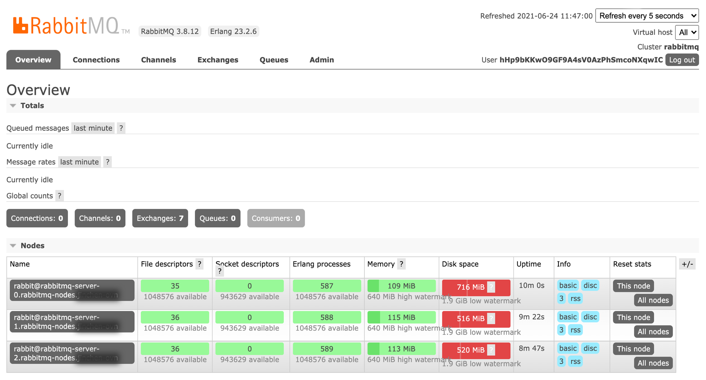

# Management UI 的使用

本文仅介绍 Management UI (Management Interface) 中的基本操作，更多内容请参见 [RabbitMQ 官方文档](https://www.rabbitmq.com/docs/management) 。

## 获取 Management UI 访问地址

### 实例未开启集群外访问

如果实例未开启集群外访问功能，则需要设置负载均衡来设置反向代理。

<Tabs>
<Tab label="Web Console">
1. 在 **客户端** 区域，单击 **添加管理端口**。

2. 参考以下说明配置相关参数。

    | 参数       | 说明                                                         |
    | ---------- | ------------------------------------------------------------ |
    | **负载均衡器** | 集群外的生产者和消费者将通过此负载均衡器的地址访问实例。|
    | **端口** | 负载均衡器通过此端口监听访问流量，并接收来自生产者和消费者的 TCP 访问请求。|
    | **内部路由组** | 访问流量将默认通过此内部路由转发到实例。|
    | **会话保持**   | 若根据 **源地址哈希** 进行会话保持，源自同一 IP 地址的访问请求将始终被转发至内部路由对应的后端服务。 |

3. 单击 **添加**。

4. 单击 **端口** 列提供的链接，在新的浏览器页签中登录 Management UI。
</Tab>
</Tabs>

### 实例开启了集群外访问

<Tabs>
<Tab label="Web Console">

1. 在左侧导航栏中，单击 **RabbitMQ**。

2. 单击 ***实例名称*** 。

3. 在 **访问方式** 页签中，单击***管理门户地址***。

</Tab>
</Tabs>

登录 Management UI 后，其页面如下图所示：

## 使用 Management UI

1. 参考 [用户管理](../../functions/20-user) 来获取登录信息。

2. 创建交换机。

    1. 在 **Exchanges** 页签中，展开 **Add a new exchange**。

    2. 填写相关信息，单击 **Add exchange**。

3. 创建队列。

    1. 在 **Queues** 页签中，展开 **Add a new queue**。

    2. 填写相关信息，单击 **Add queue**。

        > **提示**：配置合理的消息超时参数（例如 `x-message-ttl=3600000`）可避免消息积压。积压过多消息可能会导致持久卷声明因未及时消费旧消息，无足够空间承载新消息而影响服务运行。

4. 将队列绑定到交换机。

    1. 在 **Exchanges** 页签中，单击交换机的名称。

    2. 展开 **Bindings**，填写目标队列的名称，并设置 **Routing key**。

    3. 单击 **Bind**。

5. 发送消息。

    1. 在 **Exchanges** 页签中，单击交换机的名称。

    2. 展开 **Publish message**，填写交换机中设置的 **Routing key** 取值，并在 **Payload** 处填写消息内容。

    3. 单击 **Publish message**。

6. 接收消息。

    1. 在 **Queues** 页签中，单击队列的名称。

    2. 展开 **Get messages**，单击 **Get Message(s)**。

    3. 查看消息内容。

